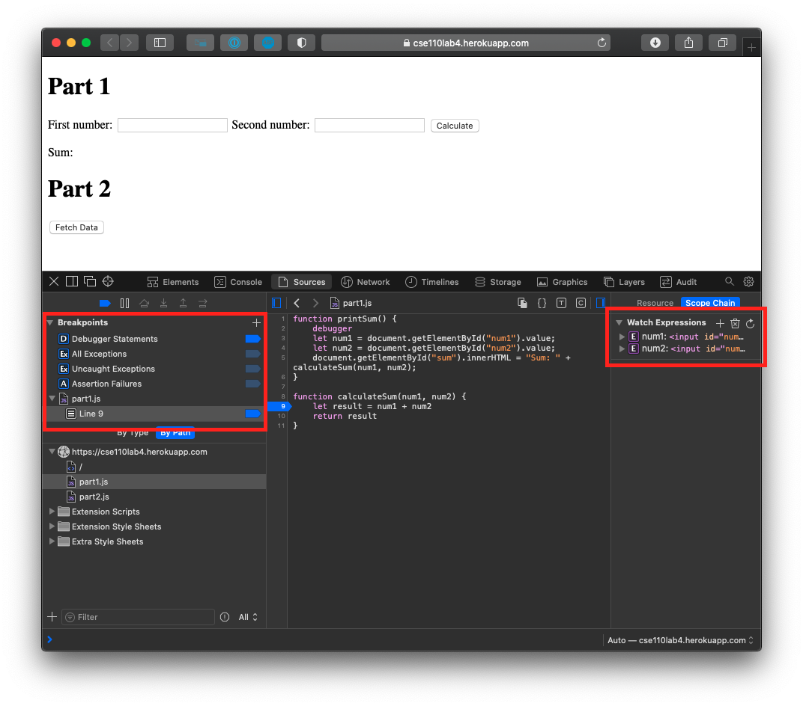
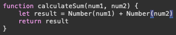

# Lab 4 Part 3
## DevTools - Debugging

Screenshot showing the breakpoint and watch expressions:

The bug was that both num1 and num2 are string values, and therefore the `+` operator performs a string concatenation. The fix would be to cast them to numbers, as shown:

## DevTools - Network Tab

1. The json file fetched is called `citylots.json`
2. The file was downloaded by `part2.js`
3. The file is 11.1 MB
4. It took 546.5ms to download the file
5. `Mozilla/5.0 (Macintosh; Intel Mac OS X 10_15_7) AppleWebKit/605.1.15 (KHTML, like Gecko) Version/14.0 Safari/605.1.15`
6. `Apache`
7. `Tue, 26 Jan 2021 22:14:13 GMT`
8. `application/json`
9. `fetchData()`

